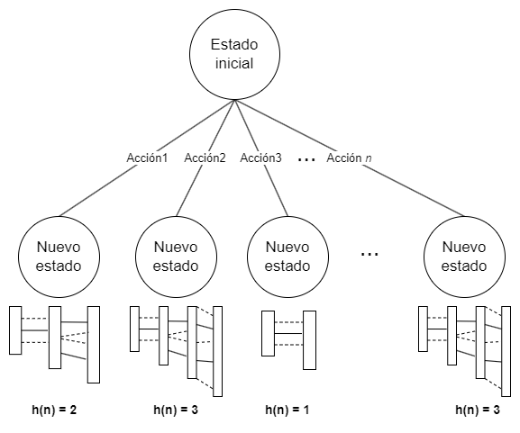

# Fast Forward Planner
Este repositorio implementa un enfoque de planificación inspirado en los planificadores Fast Forward, utilizando el algoritmo de búsqueda A* para una exploración eficiente del espacio de soluciones.

## Introducción
Llamaremos planificación al proceso de búsqueda y articulación de una secuencia de acciones que permitan alcanzar un objetivo.
Para resolver un problema de planificación, necesitamos proposiciones (llamadas literales) que describan los estados, y acciones que alteran estos literales (cambiando el estado).

En el campo de la planificación, el lenguaje base es el [STanford Research Institute Problem Solver (STRIPS)](https://ai.stanford.edu/users/nilsson/OnlinePubs-Nils/PublishedPapers/strips.pdf), que aunque es ampliamente utilizado, a veces no proporciona la suficiente expresividad para abordar ciertos problemas complejos. Como resultado, se han desarrollado extensiones más avanzadas, como el [Action Description Language (ADL)](https://en.wikipedia.org/wiki/Action_description_language).

_GraphPlan_ es un algoritmo fundamental que construye una gráfica de planificación para representar las secuencias de acciones necesarias para alcanzar un objetivo. Sin embargo, su complejidad ha llevado a la creación de los Fast Forward Planners, que utilizan una versión simplificada de esta gráfica para construir una heurística eficiente y guiar la búsqueda hacia soluciones rápidas usando algoritmos de búsqueda como A*.

El algoritmo A* es una técnica de búsqueda heurística usada para encontrar la ruta más corta en un grafo. Utiliza una función de costo $f(n) = g(n) + h(n)$, donde $g(n)$ es el costo desde el nodo inicial hasta el nodo actual y $h(n)$ es una estimación heurística del costo desde el nodo actual hasta el objetivo, priorizando los nodos más prometedores para alcanzar el objetivo con el menor costo total.

## Algoritmo
El algoritmo usa la búsqueda A* clásica de la siguiente manera:
```
función FastForward_A*(estado_inicial, objetivo, acciones):
    frontera ← [estado_inicial]
    
    mientras frontera no esté vacía:
        nodo ← primer elemento de frontera
        eliminar primer elemento de frontera
        
        si todos los elementos de objetivo están en nodo.estado:
            regresar nodo.plan
            
        de lo contrario:
            para cada acción en acciones:
                nuevo_estado ← acción.aplicar(nodo.estado)
                
                h ← heurística(nuevo_estado, objetivo, acciones)
                c ← nodo.costo + 1
                nuevo_nodo ← Nodo(nuevo_estado, c, h, nodo.plan)
                nuevo_nodo.plan ← nuevo_nodo.plan + acción
                    
                añadir nuevo_nodo a frontera
            
            frontera ← ordenar(frontera por función de costo)
            
    regresar "No se puede llegar al objetivo"
```
Para el cálculo de la heurística, utilizamos la gráfica de planeación. Esta gráfica se construye por niveles: el nivel $S_0$ consiste en los literales del estado del nodo respectivo. A partir de ahí, se aplican todas las acciones posibles para generar el nivel $S_1$. Este proceso continúa, creando nuevos niveles $S_i$ aplicando todas las acciones sobre el nivel anterior $S_{i-1}$, hasta que en algún nivel $S_n$ se encuentren todas las proposiciones del estado objetivo.

La heurística se define como la cantidad de niveles necesarios para alcanzar todas las proposiciones del estado objetivo. Es decir, el valor heurístico es el nivel final de la gráfica de planeación, ya que este nivel proporciona una estimación óptima de la cantidad de pasos requeridos para llegar al objetivo.

A continuación, se presenta un ejemplo (ver imagen) que ilustra cómo se calcula la heurística para varios nodos. Esta imagen muestra los primeros nodos generados por el algoritmo A* y cómo se determina la heurística $h(n)$ para estos.

<p align="center">

</p>

## Ejemplos

Para demostrar la aplicación de este algoritmo, hemos realizado algunos ejemplos implementados en libretas de Jupyter. Si está interesado en la implementación del algoritmo y el código, a continuación se enumeran estos ejemplos. Haga clic en los enlaces para ver las libretas correspondientes:

- [Mundo del robot](notebooks/Robot.ipynb)
- [Mundo de los bloques](notebooks/BlockWorld.ipynb)
- [Planear cena](notebooks/DinnerPlanning.ipynb)